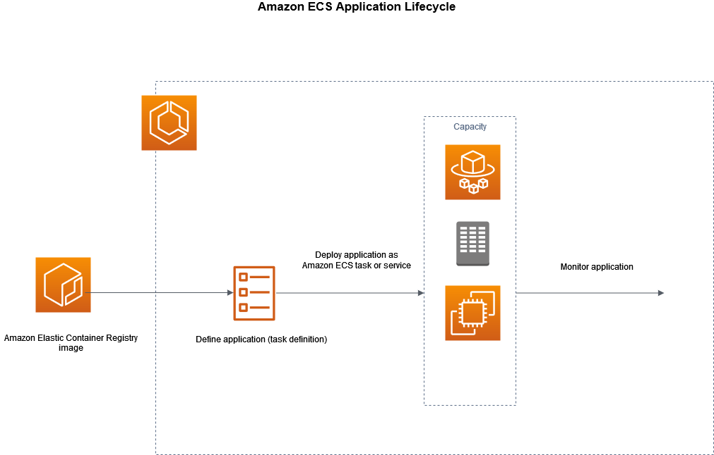

# Exploring Amazon ECS and Fargate

## 1. Introduction to Amazon ECS
   - Amazon Elastic Container Service (Amazon ECS) is a fully managed container orchestration service that helps you easily deploy, manage, and scale containerized applications.
   - Amazon ECS comes with AWS configuration and operational best practices built-in.
   - It is integrated with both AWS and third-party tools, such as Amazon Elastic Container Registry and Docker. 
   - This integration makes it easier for teams to focus on building the applications, not the environment.
   - You can run and scale your container workloads across AWS Regions in the cloud, and on-premises, without the complexity of managing a control plane.
   - There are three layers in Amazon ECS:
     - **Capacity** - The infrastructure where your containers run.
     - **Controller** - Deploy and manage your applications that run on the containers.
     - **Provisioning** - The tools that you can use to interface with the scheduler to deploy and manage your applications and containers

## 2. Understand various features of ECS Cluster

### [2.1 Services](https://docs.aws.amazon.com/AmazonECS/latest/developerguide/ecs_services.html)
A *Service* allows you to run and maintain a specified number of simultaneous instances of a task defination in an ECS cluster.

### [2.2 Tasks](https://docs.aws.amazon.com/AmazonECS/latest/developerguide/task_definitions.html)
A *Task* is an instance of Task defination. A task defination is a blue print of your application.

### 2.3 ECS Instances
EC2 instances which gets created when you create an EC2 type ECS cluster.

### 2.4 Metrics 
Cloudwatch container insights collects and aggregates metrics, logs from your containerized applications.

### 2.5 Scheduled Tasks

### 2.6 Tags

### 2.7 Capacity Providers

## 3. Application Lifecycle
   

## 4. ECS Cluster Types
There are three types of ECS clusters namely:
   1) Fargate clusters (serverless)
   2) ECS EC2 - Linux cluster
   3) ECS EC2 - Windows cluster

     
## 5. Hands-on Lab: Create an Amazon ECS cluster
   - Lab-01: Create an ECS cluster of type `EC2 Linux cluster`
   - Lab-02: Create an ECS cluster of type `Fargate`

## 6. Understanding Task Definition
   - A `task definition` is a blueprint for your application. 
   - It is a text file in JSON format that describes the parameters and one or more containers that form your application.
   - Below parameters are defined in the Task definition:
     - Docker image to be used for Application
     - Resources (CPU and memory) is required by the task
     - Launch type to use
     - Docker networking mode
     - Logging configuration
     - IAM Role that your task will use
   - After you create a task definition, you can run the task definition as a *task* or a *service*.
   - [Example task definitions](https://docs.aws.amazon.com/AmazonECS/latest/developerguide/example_task_definitions.html)

## 7. Hands-on Lab: Create a Task Definition

## [8. Hands-on Lab: Create a Service](https://docs.aws.amazon.com/AmazonECS/latest/developerguide/create-service-console-v2.html)

## 9. Hands-on Lab: Create a Task based on the Task-definition created in #7

## 10. Hands-on Lab: Accessing application running in ECS cluster

## 11. Amazon ECS Deployment Types
   - An Amazon ECS deployment type determines the deployment strategy that your service uses. 
   - There are three deployment types:
     1) [Rolling Update](https://docs.aws.amazon.com/AmazonECS/latest/developerguide/deployment-type-ecs.html)
     2) [Blue-Green deployment](https://docs.aws.amazon.com/AmazonECS/latest/developerguide/deployment-type-bluegreen.html)
     3) [External Deployment](https://docs.aws.amazon.com/AmazonECS/latest/developerguide/deployment-type-external.html)

## [12. Service Load balancing](https://docs.aws.amazon.com/AmazonECS/latest/developerguide/service-load-balancing.html)

## [13. Service Autoscaling](https://docs.aws.amazon.com/AmazonECS/latest/developerguide/service-auto-scaling.html)

## [14. Amazon ECS Pricing](https://aws.amazon.com/ecs/pricing)

## [15. References](https://docs.aws.amazon.com/AmazonECS/latest/developerguide/Welcome.html)